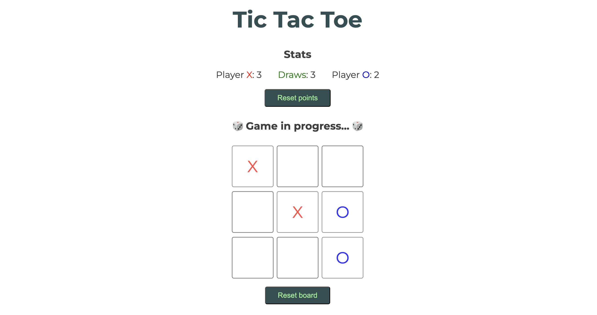

# Vue.js Tic Tac Toe


## Description

The classic Tic Tac Toe game, developed in Vue.js with JavaScript.



## Installation

If you're using OS X or Windows, use one of the installers from the
 [Node.js download page](https://nodejs.org/en/download/). LTS versions of
  Node.js are recommended.

Clone Github repo:

```bash
git clone https://github.com/Gio-Mex/vue-tic-tac-toe.git
```

Install package:

```bash
npm install
```
Now run `ng serve` for a dev server. Navigate to http://localhost:5173/
`ng build` only executes the builder for the build target in the default project
 as specified in package.json. 

## Usage 
Select a cell by clicking on it, first player is X and second player is O. That cell cannot be selected again.  
First player to get 3 in a row wins, and stats will be updated.  
Click on Reset button to start a new game, or on Reset points button to reset all stats.

## Demo
Try the app [here](https://vue-tictactoe-game.netlify.app).
